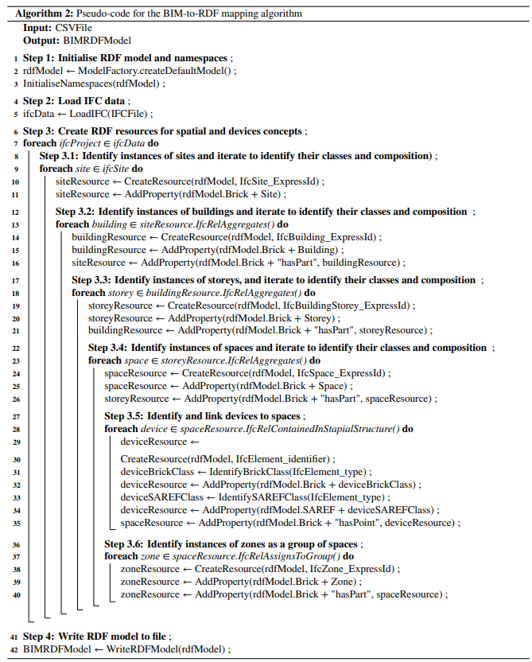

# Semantics-driven controls applications

This repository contains the data and code to support our paper, under review, entitled "A semantics-driven framework to enable demand flexibility control applications in real buildings". 

The repository primarily hosts mapping algorithms (RDFConverter) designed to generate semantic models to enable the self-configuration of DF control applications. The mapping algorithms assist in creating semantic models by mapping metadata from Building Information Modeling (BIM) and Building Automation System (BAS) sources while adhering to Brick and SAREF concepts. Specifically, the BIM algorithm maps metadata from an IFC model to RDF, while the BAS algorithm maps metadata from a CSV point list to RDF.

The repository also contains examples for sample files used for generating semantic models based on our algorithms, as well as actors scripts with DF controls' functions and sample SPARQL queries used to configure them. 


## Prerequisites

Before getting started with the repository, ensure you meet the following prerequisites:

1. Java Development Kit (JDK):

   The mapping algorithms requires JDK for compilation and execution. 

2. Maven:

   The mapping algorithms uses Maven for managing project dependencies and building the project. If Gradle is preferred instead, the information about dependencies within the `pom.xml` file need to be adapted accordingly.

3. Familiarity with Apache Jena Framework:

   The mapping algorithms are built on the Apache Jena Framework. Familiarise with the framework by exploring the [Jena tutorials]( https://jena.apache.org/tutorials/index.html). 

## Getting started 

To use the mapping algorithms, follow these steps:

1. Clone the repository
   ``` 
   git clone https://github.com/ucl-sbde/semantics-driven_controls.git 
   ```

2. Install/download the dependencies

   All project dependencies required to run the mapping algorithms are declared within the `pom.xml` file.
   
   For the BIM-to-RDF mapping, we use a purpose-built BIM library package [(gr.tuc.bim-library)](https://github.com/kyriakos-katsigarakis/openmetrics/packages/875264). Ensure to download all files from the [bim-library directory](https://github.com/ucl-sbde/semantics-driven_controls/tree/main/bim-library) and place them in the appropriate directory (e.g.,  `C:\Users\YOURUSER\.m2\repository\gr\tuc\bim-library\0.0.1-SNAPSHOT`) if using Visual Studio Code.
   
3. Run the converters (mapping) 

   To generate the models from the BIM and BAS metadata sources, execute the `ConvertersProxy.java` script. This script will call both converters.

4. Merge the models

   Once both models are generated separately, you can merge them using the `MergeTTLModels.java` script.


## How do the mapping algorithms work?

1. BAS-to-RDF converter

   The BAS-to-RDF mapping algorithm is based on a simple CSV template following a structure of how some BAS point lists can be often exported from BAS tools.The template has a header row stating the corresponding classes and entity properties of each column. These include `Device name` which refers to descriptions for classifying devices/equipment, `Device identifier` which adds given identifiers to each device (e.g., serial numbers), 
   `Data point name`  which refers to descriptions for measurement and control points related to the devices (e.g., "Writable temp sp point" referring to a temperature setpoint) and `Data point identifier` which informs the external reference identifier that provides data reading and writing access to each of the points.

   The process provided by our algorithm for mapping BAS metadata within this CSV template into RDF involves multiple steps. First, the script identifies the unique `Device identifier` and, based on their corresponding `Device name`, associates them with a Brick and SAREF class. Second, for each unique identified device, the script iterates over the rows of the CSV, creating individual instances of their respective data points. Then, the script identifies the Brick and SAREF concepts corresponding to each data point using the description within the `Data point name` column. For each data point, its also adds their external references based on the `Data point identifier`. Finally, the script links each data point with the respective device.

   


2. BIM-to-RDF converter

   The result of this BAS into RDF mapping leads to a preliminary semantic model covering only classes related to devices and measurement and control points. To supplement this initial model with additional BIM metadata, our work proposes a BIM-to-RDF mapping algorithm. The BIM-to-RDF script builds on top of the existing efforts, extending a previous [work](https://github.com/kyriakos-katsigarakis/openmetrics) by the authors. 

   In this BIM-to-RDF process, IFC data are extracted for the retrieval of spatial characteristics (e.g., s4bldg:BuildingSpace and brick:Space) and device information such as their classes and properties. The template mapping algorithm follows the IFC hierarchy, iterating over each instance and using the spatial containment concept (`IfcRelContainedInSpatialStructure`) to identify the contained physical resources in each space. This spatial containment feature makes it possible to extract the relationship between resources, such as thermostats and HVAC terminal units, as contained within space and related to a zone.

   

## Examples

The [examples directory](https://github.com/ucl-sbde/semantics-driven_controls/tree/main/examples) includes:

1. Sample files and generated models

    The sample files in IFC and CSV formats should serve as illustrative inputs for the mapping algorithms. The directory also contains the models generated by the algorithms for these two sample files. 

2. Control actors

   The control actors host example scripts for running DF functions, including ators for executing SPARQL queries, reading and writing data and executing logic. 

3. Brick and SAREF driven SPARQL queries

   The SPARQL queries are examples of queries that can support the configuration of control applications using both Brick and SAREF concepts.

